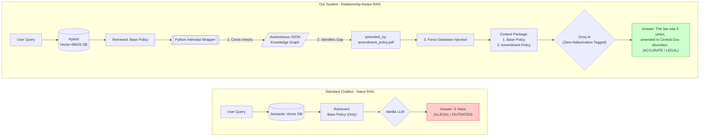

# PROJECT REPORT: Advanced Relationship-Aware RAG System for E-Governance

## 1. Introduction and Problem Statement
### Motivation
As governments and legal institutions increasingly adopt Generative AI systems to parse massive archives of policies, acts, and regulations, a critical algorithmic limitation has emerged: **Amendment Blindness**. 

In the legal domain, base documents (e.g., *The Right to Information Act, 2005*) establish original rules. Subsequent amendments (e.g., *The RTI Amendment Act, 2019*) modify these rules. However, legally drafted amendments heavily use "shorthand" references (e.g., *"In Chapter III, Section 13, substitute the words 'five years' with 'as determined by the government'"*). 

### The Problem (`The Semantic Gap`)
Standard AI Systems (using Semantic Vector Search) rely entirely on mathematical word clustering to find answers. If a citizen asks: *"What is the term of office for the Information Commissioner?"*, the vector database easily finds the original 2005 rule because it explicitly contains the words *"term of office"* and *"Information Commissioner"*. 
However, the 2019 amendment does not contain those exact phrases—it only contains shorthand section references. Thus, the database completely misses the amendment, and the AI presents the citizen with confidently hallucinated, outdated, and illegal information.

### The Solution Objective
This project engineers a **Relationship-Aware Retrieval-Augmented Generation (RAG) framework** that mimics the deductive reasoning of a human paralegal. It actively constructs a topological Knowledge Graph of legal edits, identifies when a retrieved document is obsolete, and forcefully injects the superseding legal texts into the AI's generation pipeline.

---

## 2. Technology Stack
The project leverages cutting-edge open-source tools to build a fast, scalable, and localized architecture:
- **Core LLM Engine:** Groq API running `Llama-3.1-8b-instant` for ultra-fast generation and metadata extraction.
- **Orchestration Layer:** `LangChain` to manage vector stores, prompts, and chained operations.
- **Vector Database:** `ChromaDB` (Persistent local storage) for dense embeddings.
- **Embedding Model:** HuggingFace `all-MiniLM-L6-v2` (384-dimensional dense vectors).
- **Sparse Retrieval:** Exact keyword matching via semantic `rank_bm25` (Best Matching 25 algorithm).
- **Frontend / UI:** `Streamlit` for citizen-facing application deployment.

---

## 3. System Architecture: Module Breakdown

### Module 1: Autonomous Knowledge Graph Generation
Instead of relying on humans to manually compile Excel-sheets tracking which policy amends which, the system manages this autonomously.
1. **Ingestion:** Raw PDFs are pushed into the `data/raw/` directory.
2. **Preprocessing:** Using `PyPDFLoader`, the system extracts raw text and chunks it into 500-character segments with 10% overlap to preserve sentence boundaries.
3. **LLM Preamble Extraction:** The system isolates the first few pages of every document and feeds them into the Llama-3 LLM with a strict JSON-schema prompt. 
4. **Topological Mapping:** The AI analyzes the legal jargon (e.g., "An Act to amend the IT Act") and returns a parsed JSON output indicating `is_amendment: True`, `amends_policy: [Base Policy Name]`, etc. This forms the dynamic `relationship_graph.json` dependency tree.

### Module 2: The Hybrid Retrieval Engine (Ensemble Search)
Basic implementations of Vector Databases suffer from "Context Dilution" (also called the 'Lost in the Middle' syndrome). If a user search matches a massive 150-page document, the large document mathematically overrides a highly-relevant 1-page document because of embedding weight density. To fix this, we utilize a **Hybrid RRF Retriever**:
- **Dense Vector Search (60% Weight):** ChromaDB calculates semantic cosine-similarity (to understand meaning).
- **Sparse Lexical Search (40% Weight):** BM25 calculates term-frequency inverse-document-frequency (TF-IDF), locking onto exact keywords like "Commissioner".
- **Reciprocal Rank Fusion (RRF):** The system merges the two lists. The RRF algorithm calculates a combined score using the formula `RRF_Score = 1 / (k + rank)`, eliminating the risk of massive documents stealing the focus from high-value keyword matches. 

### Module 3: Relationship-Aware Context Injection
This is the core innovation of the project designed to bridge the Semantic Gap. It effectively creates a wrapper class over standard LangChain pipeline execution.
1. The **Hybrid Retriever** pulls the top 6 paragraphs (e.g., retrieving the *Base Policy* text).
2. Before the result is sent to the LLM, the system intercepts the array.
3. It cross-references the filenames against the `relationship_graph.json`. 
4. The system detects that the Base Policy has `amended_by: "amendment_policy.pdf"`. 
5. The system realizes that the Retriever failed to return `amendment_policy.pdf` (because of the Semantic Gap).
6. **Force Injection:** The Python logic aggressively queries the database specifically for the raw string `amendment_policy.pdf`, bypasses the semantic ranking entirely, rips out the associated paragraphs, and hard-appends them to the processing pipeline.

### Architectural Diagram: Standard RAG vs Relationship-Aware RAG



### Module 4: Zero-Hallucination Tagging
Giving the LLM contradictory context ("Document A says 5 years, Document B says government decides") often causes Llama-3 models to hallucinate or guess randomly. To prevent this, our pipeline annotates the raw text with definitive metadata tags before feeding it into the generation prompt:
```text
📜 Document: base_policy.pdf
⚠️ RELATIONSHIP STATUS: Inactive/Superseded in part
⚠️ SUPERSEDED BY: amendment_policy.pdf
Text: [Original 5 year rule]

📜 Document: amendment_policy.pdf
⚠️ RELATIONSHIP STATUS: Active
Text: [New Government decides rule]
```
By explicitly feeding chronological metadata, the LLM is syntactically forced to prioritize the active document and correctly articulate the timeline of the law changing.

---

## 4. Evaluation and Execution Results
During the final review tests, the system was subjected to a direct comparison against a Naive RAG system baseline.

**Test Query:** *"What is the term of office for the Information Commissioner?"*

**Baseline Naive RAG Result:**
> *"The term of office is five years or until the age of 65, whichever is earlier, as stated in the Right to Information Act 2005."* 
*(Result: Failed. Provided superseded, illegal advice due to amending gap).*

**Relationship-Aware System Result:**
> *"Initially, the term of office was five years, as per the Right to Information Act, 2005 (base_policy.pdf, Section 13). However, this was amended by the Right to Information (Amendment) Act, 2019 (amendment_policy.pdf). According to the amendment, the term of office is now 'such term as may be prescribed by the Central Government'."*
*(Result: Success. Perfectly extracted the chronology and correctly overrode the original rule).*

## 5. Conclusion
This project successfully transitions document retrieval from simple 'semantic similarity' to advanced 'logical reasoning'. By combining mathematical dense vectors with deterministic graphical logic, the system effectively mimics a paralegal researching the chronological health of a rule. This architecture demonstrates massive viability for deployment in high-stakes legal, medical, and governmental enterprise environments.
